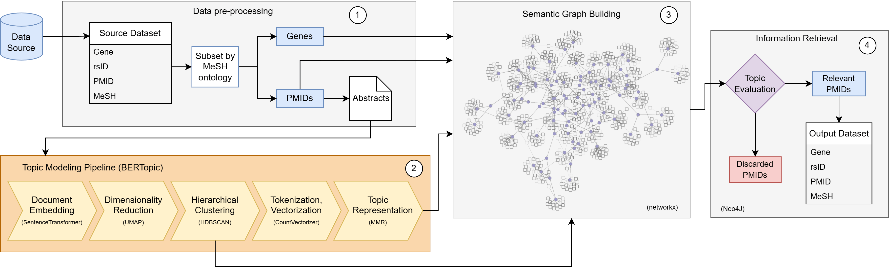

# BERTopic for Semantic Graph Information Retrieval
This repository contains the Jupyter notebook `bertopic_graph.ipynb`, which presents a semantic graph-based information retrieval system using BERTopic to analyze hidden topics within genetic literature related to MeSH terms specific to nutrigenomics.

## Repository Structure
- `data`: Harvest the data produced during the notebook execution.
- `utlis`: Contains accessory python code.
- `bertopic_graph.ipynb`: Jupyter notebook detailing the GRPM BERTopic analysis process with a focus on semantic graph-based information retrieval in the nutrigenomics domain.
- `bertopic_tutorial.ipynb`: Jupyter notebook created for educational purposes.

## Requirements
All required libraries and their specific versions used in this project are outlined within the `grpm_bertopic.ipynb` notebook. Ensure to install these dependencies before executing the notebook.

## Usage
To conduct the GRPM BERTopic analysis for semantic graph-based information retrieval in nutrigenomics, follow the steps provided in the `grpm_bertopic.ipynb` notebook. Each step includes detailed documentation and corresponding code snippets. By following these steps, you will explore complex relationships between genetic variations and MeSH terms specific to nutrigenomics.

The general workflow is illustrated below:

## About GRPM BERTopic Analysis
This analysis employs the BERTopic pipeline to:
1. Utilize a curated dataset enriched with genetic features related to nutrigenomics.
2. Preprocess the dataset based on MeSH terms specifically chosen for the nutrigenomics domain.
3. Implement the BERTopic methodology to perform topic modeling on the dataset, enabling a structured exploration of genetic influences, interactions, and implications in nutrigenomics.
4. Construct a semantic graph representing intertopic relationships and dependencies, fostering enhanced information retrieval and contextual understanding within the nutrigenomics domain.

## About the Semantic Graph

The semantic graph serves as the foundation of the information retrieval system, encapsulating the intricate relationships and dependencies between topics.
By querying the semantic graph, researchers can navigate through the interconnected topics and retrieve relevant information with contextual understanding.
We employed the hierarchical clustering tree as the root of the semantic graph through the aggregation of semantically associated topics into coherent clusters.

The complete graph consists of three layers:
1. The first layer is the backbone of the graph, it consists in the hierarchical tree connecting each detected topic and the most semantically significant terms for each topic (based on c-TF-IDF score). It can be observed that some terms are common across multiple topics.
2. The second layer of the graph contains nodes related to the papers with PubMed URLs
3. The third layer comprises the complex network of genes associated with each cluster of papers.

The complete graph is available in 'data/semantic_graph.graphml' and can be loaded into tools like Neo4J or Cytoscape for its examination.

If you encounter any challenges or have inquiries, feel free to raise an issue in this repository.